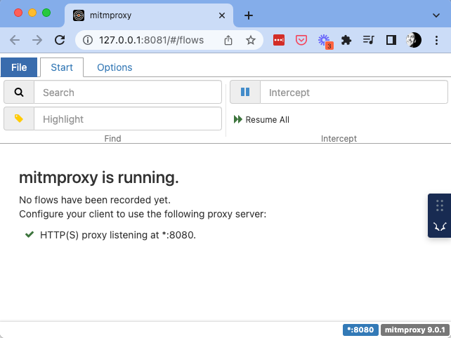
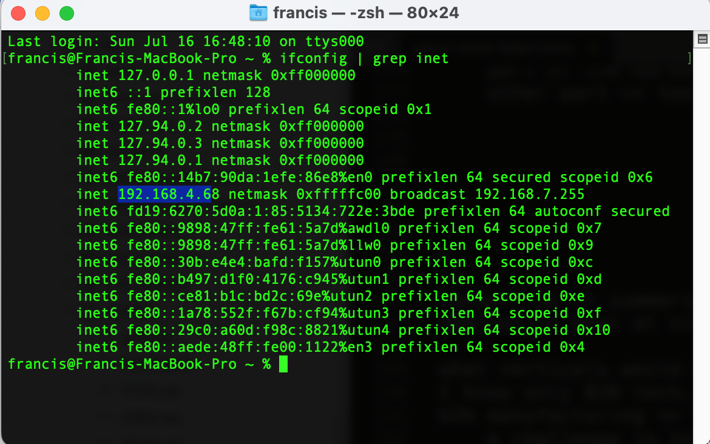
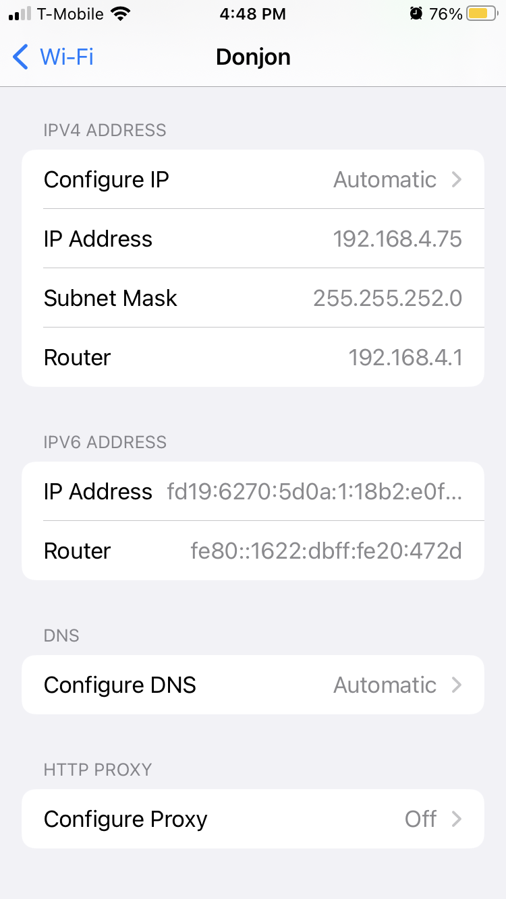
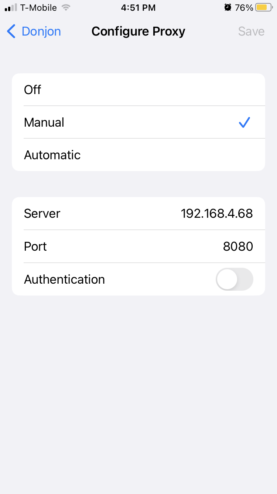
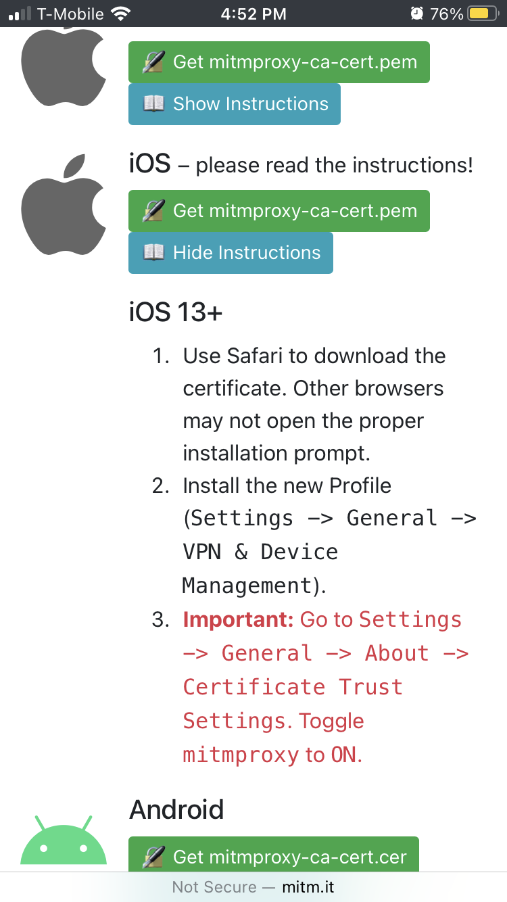
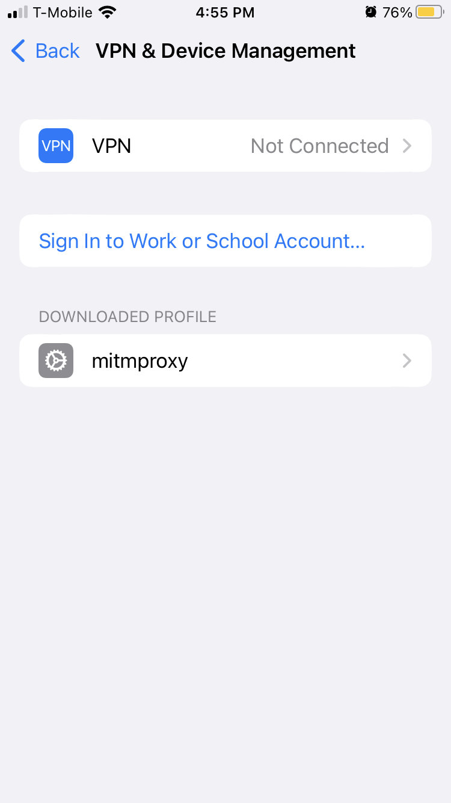
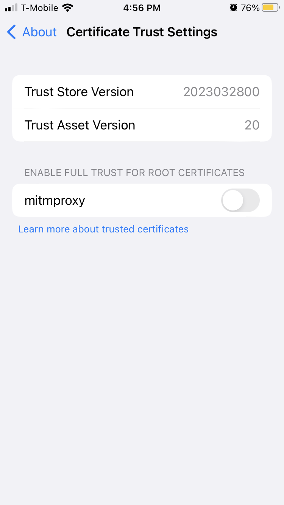
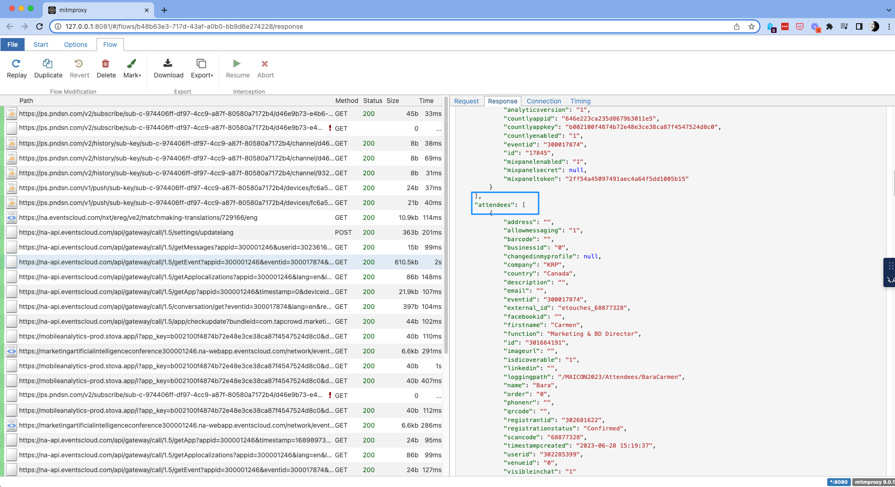
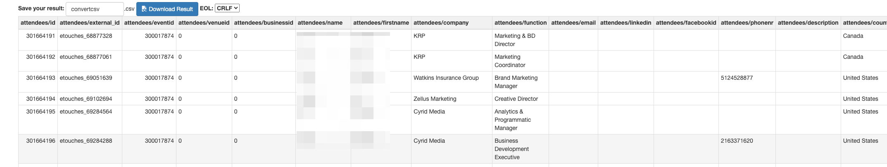

Welcome to Scrape city!
=======================
This repository contains a few scrapers:
- ios scraper (see instructions below)
- [brella app scraper](./brella/README.md)

# ios-scraper
There's a ton of value to get from getting the list of attendees of marketing events you are thinking of attending. However, you usually need to be a sponsor to get the full list.
The following steps will allow you to scrape the attendee lists from the iOS event app.
It implements a man-in-the-middle attack to catch all HTTP calls made by your phone while you're browsing the app in order to be able to download the content of the app.

## install HTTPS Debugger
Mitmproxy is a free and open source interactive HTTPS proxy. 
```bash
brew install mitmproxy
```
## start the web interface for the proxy
```bash
mitmweb
```
You should see this screen


## get your IP
```bash
ifconfig | grep inet
```
In my case it is `192.168.4.6`


## connect to the proxy
On your iPhone, go to <b>Settings | Wi-Fi </b> and to the properties of your Wi-Fi network. 


Switch the HTTP Proxy to manual and set the it to the IP address of your computer running mitmproxy and port 8080.


## configure certificates
go to `mitm.it`
download the iOS certificate


go to Settings -> general -> vpn & device management to install the new Profile


go to Settings -> about -> certificate trust settings to toggle mitmproxy to ON



## open the event app
All the traffic is being intercepted
Find the call that is getting pulling the list of attendees and download the JSON


Convert the JSON to CSV https://www.convertcsv.com/json-to-csv.htm


# Uninstall everything
if you don't want to have all your traffic intercepted, let's turn everything off
- kill the mitmweb command in the terminal
- turn off the mitmproxy certificate on your phone
- remove the mitmproxy profile ion the VPN & Device management settings
- turn the wifi proxy settings back to "off"

feedback is welcome!
