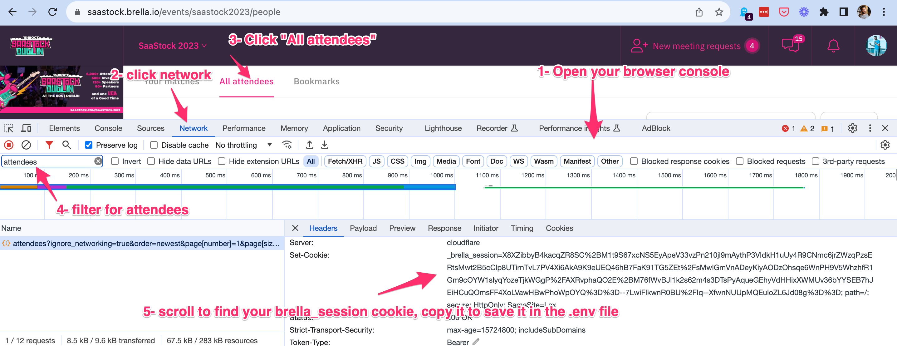

What is this?
=============
This will download the first 2000 attendees from Brella and save them in a CSV file.

# Configure your credentials
Rename the .env_sample file to .env
Update the values of the variables:
- your email to log in
- the event which is usually in the URL: e.g. https://saastock.brella.io/events/{EVENT}

## Get your session cookie


# Run the script
## Directly
```bash
python3 ./lib/brella.py
```

## Run the script in a venv 
Let's spin up a virtual environment
``` bash
python3 -m venv env
source env/bin/activate
```
let's install the required libraries on the virtual environment
``` bash
pip install -r ./lib/requirements.txt
```
Now let's run the file
```bash
python ./lib/brella.py
```

Close the environment
```bash
deactivate
```

This will create 2 files:
- brella.json => this file is the raw payload for troubleshooting. Feel free to ignore it
- brella.csv => this is the list of attendees with a few relevant fields

# Notes
## Number of attendees downloaded
If you want to get more, you can update the parameters [here](brella.py)
```JSON
'page[size]': 2000,
```

## Attributes to get from the payload
If you want to get more attributes, you can update the list [here](brella.py)
```python
attributes = ['email', 'first-name', 'last-name', 'company-title', 'company-name', 'website', 'linkedin']
```

## Feedback
Feel free to share feedback, request additions...